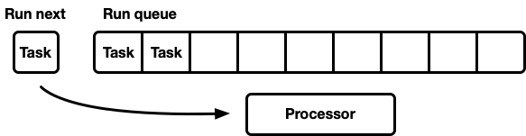

# The next generation Tokio Scheduler

## The new task system

먼저, 토키오의 일부가 아니지만 달성한 일부 이득에 매우 중요한 것을 강조하는 것이 중요합니다. 바로 Taylor Cramer가 주로 설계한 std에 포함된 새로운 작업 시스템입니다. 이 시스템은 스케줄러가 Rust 비동기 작업을 실행하기 위해 구현해야 하는 훅을 제공하며, 정말 잘 만들어졌습니다. 이전 반복 작업보다 훨씬 가볍고 유연합니다.

Waker 구조체는 리소스에 의해 보유되며 태스크가 실행 가능함을 알리고 스케줄러의 실행 대기열로 넣는 데 사용됩니다. 새로운 작업 시스템에서 Waker 구조체는 포인터 두 개 크기로 이전에는 훨씬 컸습니다. 크기를 줄이면 Waker 값을 복사할 때 발생하는 오버헤드를 최소화할 수 있을 뿐만 아니라 구조체의 공간을 덜 차지하여 캐시 라인에 더 많은 중요 데이터를 저장할 수 있습니다. 커스텀 vtable 설계는 나중에 설명할 여러 가지 최적화를 가능하게 합니다.

## A better run queue

실행 대기열은 스케줄러의 핵심입니다. 따라서 제대로 구현해야 할 가장 중요한 구성 요소일 것입니다. 원래 Tokio 스케줄러는 단일 생산자, 다중 소비자 큐인 크로스빔의 큐 구현을 사용했습니다. 작업은 한쪽 끝으로 푸시되고 값은 다른 쪽 끝에서 팝됩니다. 대부분의 경우 값을 푸시하는 스레드가 값을 팝하지만, 때때로 다른 스레드가 값을 직접 팝하여 "훔치기도" 합니다. 큐는 배열과 머리와 꼬리를 추적하는 인덱스 집합으로 뒷받침됩니다. 큐가 가득 차면 큐를 밀어 넣으면 스토리지가 커집니다. 새롭고 더 큰 배열이 할당되고 값이 새 저장소로 이동됩니다.

큐가 커지면 복잡성과 오버헤드 비용이 발생합니다. 푸시/팝 작업은 이러한 증가를 고려해야 합니다. 또한, 증가 시 원래 배열을 해제하는 데는 추가적인 어려움이 따릅니다. 가비지 컬렉션 언어에서는 기존 배열이 범위를 벗어나면 결국 GC가 이를 해제합니다. 하지만 Rust에는 GC가 없습니다. 즉, 배열을 해제할 책임이 있지만 스레드가 동시에 메모리에 액세스하는 과정에 있을 수 있습니다. 이에 대한 크로스빔의 해답은 [에포크 기반 매립 전략(epoch based reclamation strategy)](https://aturon.github.io/blog/2015/08/27/epoch/#epoch-based-reclamation)을 사용하는 것입니다. 비용이 많이 들지는 않지만 핫 경로(많이 실행되는 경로)에 사소하지 않은 오버헤드가 추가됩니다. 이제 모든 작업은 중요 섹션에 들어오고 나갈 때 원자적 RMW(읽기-수정-쓰기) 작업을 실행하여 메모리가 사용 중임을 다른 스레드에 알리고 해제되는 것을 방지해야 합니다.

실행 대기열을 늘리는 데 드는 비용 때문에 대기열을 늘리는 것이 꼭 필요한지 조사해 볼 필요가 있습니다. 이 질문이 결국 스케줄러 재작성에 박차를 가하게 된 계기가 되었습니다. 새 스케줄러의 전략은 프로세스당 고정된 크기의 큐를 사용하는 것입니다. 대기열이 가득 차면 로컬 대기열을 늘리는 대신 작업이 다중 소비자, 다중 생산자 대기열인 글로벌 대기열로 푸시됩니다. 프로세서는 이 글로벌 큐를 가끔씩 확인해야 하지만 로컬 큐보다 훨씬 적은 빈도로 확인해야 합니다.

초기 실험에서는 크로스빔 대기열을 제한된 mpmc 대기열로 대체했습니다. 하지만 푸시와 팝 모두에서 수행되는 동기화 양이 많았기 때문에 큰 개선 효과를 얻지 못했습니다. 작업 훔치기 사용 사례에서 기억해야 할 핵심 사항은 부하가 걸렸을 때 각 프로세서가 자신의 큐에만 액세스하기 때문에 큐에서 경합이 거의 발생하지 않는다는 것입니다.

이 시점에서 저는 Go 소스를 자세히 읽어보기로 했고, 고정 크기의 단일 생산자, 다중 소비자 대기열을 사용한다는 사실을 발견했습니다. 이 큐의 인상적인 점은 작동하는 데 동기화가 거의 필요하지 않다는 것입니다. 결국 저는 이 알고리즘을 Tokio 스케줄러에 사용하도록 조정하고 몇 가지 변경을 가했습니다. 특히, Go 구현은 원자 연산에 순차적 일관성을 사용합니다(저의 제한된 Go 지식에 근거하여). 또한 Tokio 스케줄러의 일부로 구현된 버전은 코드 경로의 복사 빈도를 일부 줄였습니다.

큐 구현은 배열을 사용하여 값을 저장하는 순환 버퍼입니다. 원자 정수(atomic integer)는 헤드와 테일 위치를 추적하는 데 사용됩니다.

```rust
struct Queue {
    /// Concurrently updated by many threads.
    head: AtomicU32,

    /// Only updated by producer thread but read by many threads.
    tail: AtomicU32,

    /// Masks the head / tail position value to obtain the index in the buffer.
    mask: usize,

    /// Stores the tasks.
    buffer: Box<[MaybeUninit<Task>]>,
}
```

대기열에 푸시하는 작업은 단일 스레드에서 수행됩니다:

```rust
loop {
    let head = self.head.load(Acquire);

    // safety: this is the **only** thread that updates this cell.
    let tail = self.tail.unsync_load();

    if tail.wrapping_sub(head) < self.buffer.len() as u32 {
        // Map the position to a slot index.
        let idx = tail as usize & self.mask;

        // Don't drop the previous value in `buffer[idx]` because
        // it is uninitialized memory.
        self.buffer[idx].as_mut_ptr().write(task);

        // Make the task available
        self.tail.store(tail.wrapping_add(1), Release);

        return;
    }

    // The local buffer is full. Push a batch of work to the global
    // queue.
    match self.push_overflow(task, head, tail, global) {
        Ok(_) => return,
        // Lost the race, try again
        Err(v) => task = v,
    }
}
```

이 푸시 함수에서 유일한 원자 연산은 획득 순서가 있는 로드와 릴리스 순서가 있는 저장입니다. 읽기-수정-쓰기 연산(compare\_and\_swap, fetch\_and, ...)이나 순차적 일관성은 없습니다. 이는 x86 칩에서 모든 로드/저장이 이미 "원자적"이기 때문에 중요합니다. 따라서 CPU 수준에서 이 함수는 동기화가 없습니다. 원자 연산을 사용하면 특정 최적화를 방지한다는 점에서 컴파일러에 영향을 미치지만 그게 다입니다. 첫 번째 로드는 릴렉스드 오더링으로 안전하게 수행할 수 있을 가능성이 높지만, 전환 시 측정 가능한 이득은 없었습니다.

큐가 가득 차면 push\_overflow가 호출됩니다. 이 함수는 로컬 큐에 있는 작업의 절반을 전역 큐로 이동합니다. 글로벌 큐는 뮤텍스에 의해 보호되는 침입 링크된 목록입니다. 글로벌 큐로 이동되는 작업은 먼저 서로 링크된 다음 뮤텍스가 획득되고 글로벌 큐의 꼬리 포인터를 업데이트하여 모든 작업이 삽입됩니다. 이렇게 하면 중요 섹션(critical section)이 작게 유지됩니다.

원자 메모리 순서에 대한 세부 사항을 잘 알고 있다면 위와 같이 푸시 기능에 잠재적인 '문제'가 있음을 알 수 있습니다. 획득 순서를 가진 원자 로드는 매우 약합니다. 즉, 동시 훔치기 연산이 이미 self.head의 값을 증가시켰지만 푸시를 수행하는 스레드가 캐시에 이전 값을 가지고 있어서 훔치기 연산을 인식하지 못하는 경우와 같이 오래된 값을 반환할 수 있습니다. 이는 알고리즘의 정확성에는 문제가 되지 않습니다. 푸시의 빠른 경로에서는 로컬 실행 대기열이 꽉 찼는지 여부만 고려합니다. 현재 스레드가 실행 대기열에 푸시할 수 있는 유일한 스레드라는 점을 감안할 때, 오래된 로드는 실행 대기열을 실제보다 더 꽉 찬 것으로 보게 됩니다. 큐가 꽉 찼다고 잘못 판단하여 push\_overflow 함수를 입력할 수 있지만 이 함수에는 더 강력한 원자 연산이 포함되어 있습니다. push\_overflow가 큐가 실제로 꽉 차 있지 않다고 판단하면 오류와 함께 반환되고 푸시 작업이 다시 시도됩니다. 이것이 push\_overflow가 실행 큐의 절반을 전역 큐로 이동하는 또 다른 이유입니다. 큐의 절반을 이동하면 "실행 큐가 비어 있습니다"라는 오탐이 훨씬 덜 자주 발생합니다.

대기열을 소유한 프로세서에서 발생하는 로컬 `pop`도 가볍습니다:

```rust
loop {
    let head = self.head.load(Acquire);

    // safety: this is the **only** thread that updates this cell.
    let tail = self.tail.unsync_load();

    if head == tail {
        // queue is empty
        return None;
    }

    // Map the head position to a slot index.
    let idx = head as usize & self.mask;

    let task = self.buffer[idx].as_ptr().read();

    // Attempt to claim the task read above.
    let actual = self
        .head
        .compare_and_swap(head, head.wrapping_add(1), Release);

    if actual == head {
        return Some(task.assume_init());
    }
}
```

이 함수에는 단일 원자 로드와 릴리스가 있는 `compare_and_swap`이 하나 있습니다. 주요 오버헤드는 `compare_and_swap`에서 발생합니다.

`steal` 함수는 `pop` 함수와 유사하지만 `self.tail`의 로드는 원자적이어야 합니다. 또한 `push_overflow`와 유사하게, `steal` 작업은 단일 작업이 아닌 큐의 절반을 차지하려고 시도합니다. 여기에는 나중에 다룰 몇 가지 좋은 특징이 있습니다.

마지막으로 누락된 부분은 글로벌 큐를 사용하는 것입니다. 이 큐는 프로세서 로컬 큐의 오버플로를 처리하고 프로세서가 아닌 스레드에서 스케줄러로 작업을 제출하는 데 사용됩니다. 프로세서에 부하가 걸린 경우, 즉 로컬 실행 큐에 작업이 있는 경우. 프로세서는 로컬 큐에서 최대 60개의 작업을 실행한 후 글로벌에서 팝을 시도합니다. 또한 아래에 설명된 "검색 중" 상태일 때 글로벌 큐를 확인합니다.

## Optimizing for message passing patterns

Tokio로 작성된 애플리케이션은 일반적으로 여러 개의 작은 독립 작업으로 모델링됩니다. 이러한 태스크는 메시지 전달을 사용하여 서로 통신합니다. 이 패턴은 Go나 Erlang과 같은 다른 언어와 유사합니다. 이 패턴이 얼마나 일반적인지 고려할 때, 스케줄러가 이 패턴을 최적화하는 것은 당연한 일입니다.

태스크 A와 태스크 B가 주어졌을 때 태스크 A는 현재 실행 중이며 채널을 통해 태스크 B에 메시지를 보냅니다. 채널은 태스크 B가 현재 차단되어 있는 리소스이므로 메시지를 보내는 작업으로 인해 태스크 B가 실행 가능 상태로 전환되고 현재 프로세서의 실행 대기열로 푸시됩니다. 그러면 프로세서는 다음 작업을 실행 대기열에서 꺼내서 실행하고 작업 B에 도달할 때까지 반복합니다.

문제는 메시지가 전송된 시점과 작업 B가 실행되는 시점 사이에 상당한 지연 시간이 발생할 수 있다는 것입니다. 또한 메시지와 같은 "핫" 데이터는 전송될 때 CPU 캐시에 저장되지만 작업 B가 예약될 때쯤이면 관련 캐시가 모두 지워졌을 가능성이 높습니다.

이 문제를 해결하기 위해 새로운 Tokio 스케줄러는 최적화를 구현합니다(Go 및 Kotlin의 스케줄러에서도 볼 수 있음). 작업이 실행 가능한 상태로 전환되면 실행 대기열의 뒤쪽으로 푸시하는 대신 특수한 "다음 작업" 슬롯에 저장됩니다. 프로세서는 실행 대기열을 확인하기 전에 항상 이 슬롯을 확인합니다. 이 슬롯에 작업을 삽입할 때 이미 작업이 저장되어 있으면 이전 작업이 슬롯에서 제거되고 실행 대기열의 뒤쪽으로 푸시됩니다. 메시지 전달의 경우, 이렇게 하면 메시지 수신자가 다음에 실행되도록 예약됩니다.

<figure><figcaption></figcaption></figure>

## Throttle Stealing

작업 훔치기 스케줄러에서 프로세서의 실행 대기열이 비어 있으면 프로세서는 형제 프로세서에서 작업을 훔치려고 시도합니다. 이를 위해 임의의 형제 프로세서가 시작점으로 선택되고 프로세서는 해당 형제 프로세서에 대해 작업 훔치기 작업을 수행합니다. 작업이 발견되지 않으면 다음 형제 프로세서를 시도하고 작업이 발견될 때까지 계속 시도합니다.

실제로는 많은 프로세서가 실행 대기열 처리를 거의 동시에 완료하는 것이 일반적입니다. 이는 작업 배치가 도착할 때 발생합니다(예: 소켓 준비 상태를 폴링하는 경우). 프로세서가 깨어나서 작업을 획득하고 실행한 후 완료됩니다. 이로 인해 모든 프로세서가 동시에 훔치려고 시도하므로 많은 스레드가 동일한 대기열에 액세스하려고 시도합니다. 이로 인해 경합이 발생합니다. 시작 지점을 무작위로 선택하면 경합을 줄이는 데 도움이 되지만 여전히 문제가 될 수 있습니다

이 문제를 해결하기 위해 새로운 스케줄러는 훔치기 작업을 수행하는 동시 프로세서 수를 제한합니다. 프로세서가 훔치기를 시도하는 프로세서 상태를 "작업 검색 중" 또는 줄여서 "검색 중" 상태라고 부릅니다(나중에 설명할 예정입니다). 이 최적화는 프로세서가 검색을 시작하기 전에 증가하고 검색 상태를 종료할 때 감소하는 원자 int를 가짐으로써 수행됩니다. 최대 검색자 수는 전체 프로세서 수의 절반입니다. 즉, 이 제한은 엉성하지만 괜찮습니다. 검색자 수에 대한 엄격한 제한은 필요 없고 스로틀만 있으면 됩니다. 정확도와 알고리즘 효율성을 맞바꾸는 것이니까요.

검색 상태가 되면 프로세서는 형제 워커로부터 훔치기를 시도하고 글로벌 대기열을 확인합니다.

## Reducing cross Thread Synchronization

작업 훔치기 스케줄러의 또 다른 중요한 부분은 형제 알림입니다. 프로세서가 새 작업을 발견하면 형제에게 알리는 기능입니다. 형제 스케줄러가 잠자고 있으면 깨어나서 작업을 훔칩니다. 알림 작업에는 또 다른 중요한 책임이 있습니다. 큐 알고리즘이 약한 원자 순서(획득/해제)를 사용했다는 점을 기억하세요. 원자 메모리 순서 지정이 작동하는 방식 때문에 추가 동기화 없이는 형제 프로세서가 큐에서 작업을 훔칠 수 있다는 보장이 없습니다. 또한 알림 작업은 형제 프로세서가 작업을 훔치기 위해 작업을 확인하는 데 필요한 동기화를 설정할 책임이 있습니다. 이러한 요구 사항으로 인해 알림 작업은 비용이 많이 듭니다. 목표는 CPU 사용률을 낮추지 않고 가능한 한 적은 알림 작업을 수행하는 것입니다. 즉, 프로세서에 작업이 있고 형제 프로세서가 작업을 훔칠 수 없도록 하는 것입니다. 지나치게 많은 알림을 수행하면 천둥과 같은 무리 문제(thundering herd problem)가 발생합니다.

원래 Tokio 스케줄러는 알림에 대해 순진한 접근 방식을 취했습니다. 새 작업이 실행 대기열에 푸시될 때마다 프로세서에 알림을 보냈습니다. 프로세서가 알림을 받고 깨어났을 때 작업을 발견하면 다른 프로세서에 알림을 보냈습니다. 이 로직은 매우 빠르게 모든 프로세서가 깨어나서 작업을 검색하는 결과를 가져왔습니다(경합을 유발). 대부분의 프로세서는 작업을 찾지 못하고 다시 절전 모드로 돌아가는 경우가 많았습니다.

새로운 스케줄러는 Go 스케줄러에 사용된 것과 동일한 기술을 차용하여 이 문제를 크게 개선했습니다. 이전 스케줄러와 동일한 지점에서 알림이 시도되지만, 검색 중인 상태에 있는 작업자가 없는 경우에만 알림이 발생합니다(이전 섹션 참조). 작업자가 알림을 받으면 즉시 검색 상태로 전환됩니다. 검색 상태의 프로세서가 새 작업을 발견하면 먼저 검색 상태에서 전환한 다음 다른 프로세서에 알립니다.

이 로직은 프로세서가 깨어나는 속도를 조절하는 효과가 있습니다. 여러 작업이 한꺼번에 예약된 경우(예: 소켓 준비 상태를 폴링하는 경우) 첫 번째 작업이 프로세서에 알림을 보내게 됩니다. 해당 프로세서는 이제 검색 상태가 됩니다. 배치의 나머지 예약된 작업은 검색 상태에 있는 프로세서가 하나 이상 있기 때문에 프로세서에게 알리지 않습니다. 알림을 받은 프로세서는 배치에 있는 작업의 절반을 훔쳐서 다른 프로세서에게 차례로 알림을 보냅니다. 이 세 번째 프로세서는 깨어나서 처음 두 프로세서 중 하나에서 작업을 찾아 그 중 절반을 훔칩니다. 이렇게 하면 프로세서의 원활한 증가와 작업의 빠른 로드 밸런싱이 이루어집니다.

## Reducing allocations

이전에는 생성된 작업당 두 개의 할당이 필요했지만, 새로운 Tokio 스케줄러는 생성된 작업당 하나의 할당만 필요합니다. 이전에는 태스크 구조체가 다음과 같이 생겼습니다:

```rust
struct Task {
    /// All state needed to manage the task
    state: TaskState,

    /// The logic to run is represented as a future trait object.
    future: Box<dyn Future<Output = ()>>,
}
```

그러면 `Task` 구조체도 `Box`에 할당됩니다. 이것은 제가 오랫동안 고치고 싶었던 사마귀 혹(wart)이였습니다(2014년에 처음 고치려고 시도했습니다). 이전 Tokio 스케줄러 이후 두 가지가 변경되었습니다. 첫째, `std::alloc`이 안정화되었습니다. 둘째, `future task` 시스템이 명시적 vtable 전략으로 전환되었습니다. 이 두 가지가 작업당 이중 할당의 비효율성을 마침내 없애는 데 필요한 두 가지 요소였습니다.

이제 작업 구조는 다음과 같이 표현됩니다:

```rust
struct Task<T> {
    header: Header,
    future: T,
    trailer: Trailer,
}
```

헤더와 트레일러는 모두 작업을 실행하는 데 필요한 상태이지만, "핫" 데이터(헤더)와 "콜드" 데이터(트레일러), 즉 자주 액세스하는 데이터와 거의 사용되지 않는 데이터로 나뉩니다. 핫 데이터는 구조체의 헤더에 배치되며 가능한 한 작게 유지됩니다. CPU가 작업 포인터를 역참조할 때 캐시 라인 크기(64바이트에서 128바이트 사이)의 데이터를 한 번에 로드합니다. 이 데이터는 가능한 한 관련성이 높아야 합니다.

## Reducing atomic reference counting

이 글에서 논의할 마지막 최적화는 새로운 스케줄러가 필요한 원자 참조 횟수를 줄이는 방법입니다. 작업 구조에는 스케줄러와 각 웨이커(Waker)가 핸들을 보유하는 등 많은 참조가 있습니다. 이 메모리를 관리하는 일반적인 방법은 원자 참조 카운팅을 사용하는 것입니다. 이 전략은 참조가 복제될 때마다 원자 연산이 필요하고 참조가 삭제될 때마다 원자 연산이 필요합니다. 최종 참조가 범위를 벗어나면 메모리가 해제됩니다.

이전 Tokio 스케줄러에서는 각 웨이커가 대략적으로 작업 핸들에 대한 카운트된 참조를 보유했습니다:

```rust
struct Waker {
    task: Arc<Task>,
}

impl Waker {
    fn wake(&self) {
        let task = self.task.clone();
        task.scheduler.schedule(task);
    }
}
```

작업이 깨어날 때 참조가 복제됩니다(원자 단위 증분). 그런 다음 참조가 실행 대기열로 푸시됩니다. 프로세서가 작업을 수신하고 실행을 완료하면 참조를 삭제하여 원자 감소를 일으킵니다. 이러한 원자 연산이 합산됩니다.

이 문제는 이전에 std::future 태스크 시스템 설계자에 의해 확인된 바 있습니다. Waker::wake가 호출될 때, 종종 원래의 waker 참조가 더 이상 필요하지 않다는 것이 관찰되었습니다. 이를 통해 작업을 실행 대기열로 푸시할 때 원자 참조 수를 재사용할 수 있습니다. 이제 std::future task 시스템에는 두 개의 "깨우기" API가 포함됩니다:

* [`wake`](https://doc.rust-lang.org/std/task/struct.Waker.html#method.wake) which takes `self`
* [`wake_by_ref`](https://doc.rust-lang.org/std/task/struct.Waker.html#method.wake\_by\_ref) which takes `&self`.

이 API 설계는 호출자가 원자 증분을 피하도록 호출자를 추가해서 `wake`를 사용 할 수 있도록 합니다.&#x20;

이제 구현은 다음과 같습니다.&#x20;

```rust
impl Waker {
    fn wake(self) {
        task.scheduler.schedule(self.task);
    }

    fn wake_by_ref(&self) {
        let task = self.task.clone();
        task.scheduler.schedule(task);
    }
}
```

이렇게 하면 깨우기 위해 웨이커의 소유권을 가져올 수 있는 경우에만 추가 참조 계산의 오버헤드를 피할 수 있습니다. 제 경험상 거의 항상 \&self로 깨우는 것이 바람직합니다. self로 웨이크하면 웨이커 재사용을 방지할 수 있으며(리소스가 채널, 소켓 등 많은 값을 전송하는 경우에 유용합니다), self가 필요할 때 스레드 안전 웨이크를 구현하기가 더 어렵습니다(이에 대한 자세한 내용은 다른 문서에 남겨두겠습니다).

새로운 스케줄러는 `wake_by_ref`의 원자 증분을 피함으로써 전체 "self로 깨우기" 문제를 단계적으로 처리하여 wake(self)만큼 효율적으로 만듭니다. 이는 스케줄러가 현재 활성 상태인(아직 완료되지 않은) 모든 작업의 목록을 유지하도록 함으로써 수행됩니다. 이 목록은 작업을 실행 대기열로 푸시하는 데 필요한 참조 수를 나타냅니다.

이 최적화의 어려운 점은 작업이 실행 대기열로 다시 푸시되지 않을 것이라고 보장할 수 있을 때까지 스케줄러가 목록에서 작업을 삭제하지 않도록 하는 것입니다. 이 관리 방법에 대한 구체적인 내용은 이 문서의 범위를 벗어나지만 소스에서 이에 대해 자세히 조사해 보시기 바랍니다.

### Fearless (unsafe) concurrency with Loom <a href="#fearless-unsafe-concurrency-with-loom" id="fearless-unsafe-concurrency-with-loom"></a>

정확하고 동시에 lock-free 코드를 작성하는 것은 정말 어렵습니다. 특히 메모리 안전과 관련된 버그라면 빠르고 버그가 많은 것보다는 느리고 정확한 것이 낫습니다. 가장 좋은 방법은 빠르고 정확한 것입니다. 새로운 스케줄러는 꽤 공격적인 최적화를 수행하며, 보다 전문화된 버전을 작성하기 위해 대부분의 표준 유형을 피합니다. 새 스케줄러에는 안전하지 않은 코드가 꽤 많이 있습니다.

동시 코드를 테스트하는 방법에는 몇 가지가 있습니다. 하나는 사용자가 테스트와 디버깅을 대신 수행하도록 하는 것입니다(물론 매력적인 옵션입니다). 다른 하나는 루프에서 실행되는 단위 테스트를 작성하고 버그를 발견하기를 바라는 것입니다. [TSAN](https://clang.llvm.org/docs/ThreadSanitizer.html)을 사용할 수도 있습니다. 물론 이 방법으로 버그를 발견하더라도 테스트를 루프에서 다시 실행하는 것 외에는 쉽게 재현할 수 있는 방법이 없습니다. 또한 그 루프를 얼마나 오래 실행할까요? 10초? 10분? 열흘? 이것이 Rust로 동시 코드를 테스트할 때의 상태였습니다.

저희는 이 상태를 더 이상 용납할 수 없다고 생각했습니다. 저희는 코드를 출시할 때 자신감을 갖고 싶었고, 특히 잠금 없는 동시 코드를 출시할 때 최대한 자신감을 갖고 싶었습니다. 신뢰성은 Tokio 사용자들이 기대하는 부분입니다.

이러한 요구를 해결하기 위해 새로운 도구를 만들었습니다: Loom. Loom은 동시 코드를 위한 순열 테스트 도구입니다. 테스트는 평소와 같이 작성되지만, Loom으로 실행하면 Loom은 테스트를 여러 번 실행하여 스레드 환경에서 테스트가 발생할 수 있는 모든 실행과 동작을 순열(permute)합니다. 또한 올바른 메모리 액세스, 메모리 해제 등을 검증합니다...

예를 들어, 다음은 새 스케줄러에 대한 loom 테스트입니다:

```rust
#[test]
fn multi_spawn() {
    loom::model(|| {
        let pool = ThreadPool::new();

        let c1 = Arc::new(AtomicUsize::new(0));

        let (tx, rx) = oneshot::channel();
        let tx1 = Arc::new(Mutex::new(Some(tx)));

        // Spawn a task
        let c2 = c1.clone();
        let tx2 = tx1.clone();
        pool.spawn(async move {
            spawn(async move {
                if 1 == c1.fetch_add(1, Relaxed) {
                    tx1.lock().unwrap().take().unwrap().send(());
                }
            });
        });

        // Spawn a second task
        pool.spawn(async move {
            spawn(async move {
                if 1 == c2.fetch_add(1, Relaxed) {
                    tx2.lock().unwrap().take().unwrap().send(());
                }
            });
        });

        rx.recv();
    });
}
```

충분히 정상적으로 보이지만, 다시 말하지만 loom::model 블록 내의 코드 비트는 수천 번(아마도 수백만 번) 실행되며, 매번 동작이 약간씩 달라집니다. 스레드의 정확한 순서는 매번 바뀝니다. 또한 모든 원자 연산에 대해 loom은 C++11 메모리 모델에서 허용되는 모든 다른 동작을 시도합니다. 앞서 Acquire를 사용한 원자 로드가 상당히 약하고 오래된 값을 반환할 수 있다고 언급했던 것을 기억하시죠. loom 테스트는 로드할 수 있는 모든 가능한 값을 시도합니다.

loom은 새 스케줄러를 개발하는 동안 매우 유용한 도구였습니다. 다른 단위 테스트, 수작업 테스트, 스트레스 테스트에서 놓친 10가지 이상의 버그를 발견했습니다.

눈치 빠른 독자라면 loom이 "가능한 모든 순열"을 테스트한다는 주장에 의문을 제기했을 것이고, 그렇게 하는 것이 옳다고 생각할 수도 있습니다. 순진한 동작 순열은 계승 수준에서 조합 폭발을 초래할 수 있습니다. 사소하지 않은 테스트는 결코 완료되지 않을 것입니다. 이 문제는 수년 동안 연구되어 왔으며 조합 폭발(Combinatory explosion)을 관리하기 위한 여러 알고리즘이 존재합니다. Loom의 핵심 알고리즘은 [동적 부분 순서 감소(dynamic partial order reduction)](https://users.soe.ucsc.edu/\~cormac/papers/popl05.pdf)를 기반으로 합니다. 이 알고리즘은 동일한 실행을 초래하는 순열을 잘라낼 수 있습니다. 그럼에도 불구하고 상태 공간이 너무 커져서 합리적인 시간(몇 분) 내에 완료할 수 없을 수도 있습니다. 또한 Loom은 동적 부분 순서 감소의 경계 변형을 사용하여 검색 공간의 경계를 설정할 수 있습니다.

대체로 Loom을 사용한 광범위한 테스트 덕분에 스케줄러의 정확성에 대해 훨씬 더 확신을 갖게 되었습니다.

## results

스케줄러가 무엇인지, 그리고 새로운 Tokio 스케줄러가 어떻게 큰 성능 향상을 달성했는지 살펴보았으니, 이제 정확히 어떤 성능 향상을 이루었는지 알아볼까요? 새로운 스케줄러가 매우 새롭기 때문에 아직 광범위한 실제 테스트가 이루어지지 않았습니다. 저희가 아는 것은 다음과 같습니다.

첫째, 새로운 스케줄러는 마이크로 벤치마크에서 훨씬 더 빠릅니다. 다음은 몇 가지 벤치마크에서 새 스케줄러가 개선된 방식입니다.

이전 스케줄러러

```javascript
test chained_spawn ... bench:   2,019,796 ns/iter (+/- 302,168)
test ping_pong     ... bench:   1,279,948 ns/iter (+/- 154,365)
test spawn_many    ... bench:  10,283,608 ns/iter (+/- 1,284,275)
test yield_many    ... bench:  21,450,748 ns/iter (+/- 1,201,337)
```

새로운 스케줄러

```java
test chained_spawn ... bench:     168,854 ns/iter (+/- 8,339)
test ping_pong     ... bench:     562,659 ns/iter (+/- 34,410)
test spawn_many    ... bench:   7,320,737 ns/iter (+/- 264,620)
test yield_many    ... bench:  14,638,563 ns/iter (+/- 1,573,678)
```

Hyper 벤치마크 결과 30% 정도 성능 향상을 보였다고 합니다.&#x20;
